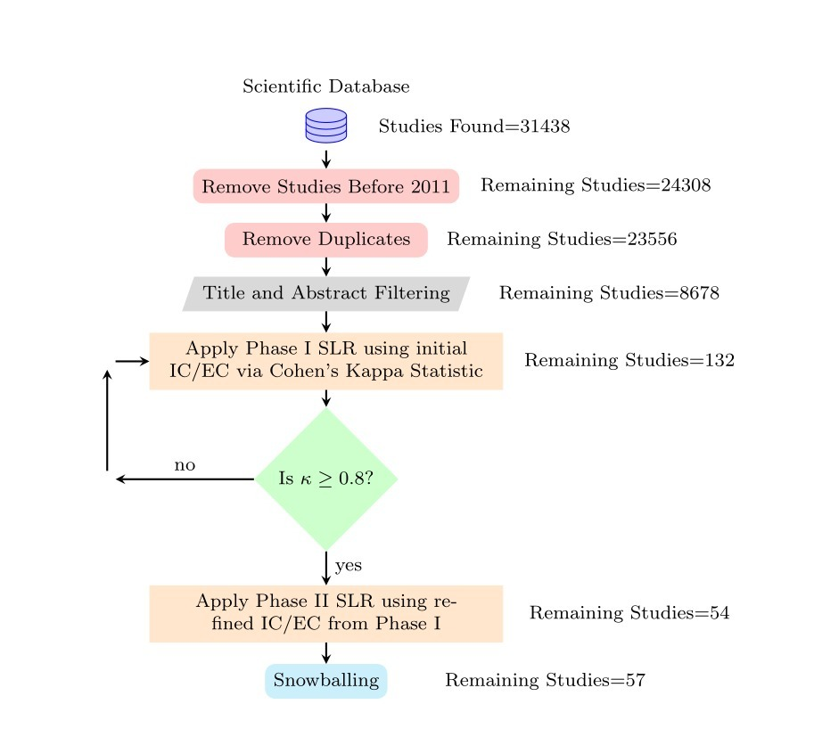

# NLP-Based Debugging: A Systematic Literature Review
We systematically categorize debugging-related activities into three major groups: **Bug Reproduction**, **Bug Localization**, and **Bug Report Analysis**.  
This repository is based on a comprehensive Systematic Literature Review (SLR) of **57 research papers published between 2010 and 2025** that leverage **Natural Language Processing (NLP)** techniques.

We welcome researchers and practitioners to contribute to this repository and help advance the collective knowledge in the field of **NLP-driven software debugging**.

## Our Study Selection Process

*Figure 1: Study selection process.*

### Bug Localization Related Studies
| Paper Title | Venue | Year |
|------------|-------|------|
| [A Topic-based Approach for Narrowing the Search Space of Buggy Files from a Bug Report](https://drive.google.com/file/d/1JsnRHi2gIDg31i78q8AV8T_y6u4HG9Vv/view?usp=sharing) | ASE | 2011 |
| [Where Should the Bugs Be Fixed? More Accurate Information Retrieval-Based Bug Localization Based on Bug Reports](https://drive.google.com/file/d/1DFHQORchj6HB4X12zFFCp_0oeetovo04/view?usp=sharing) | ICSE | 2012 |
| [Learning to Rank Relevant Files for Bug Reports Using Domain Knowledge](https://drive.google.com/file/d/1ZqxBvt9yhTUnsuUYrcFKJkzSH-kuTE6i/view?usp=sharing) | SIGSOFT/FSE | 2014 |
| [Combining Deep Learning with Information Retrieval to Localize Buggy Files for Bug Reports](https://drive.google.com/file/d/17I52dhspmBXlMu1f9bAIIj3el6DW3PAC/view?usp=sharing) | ASE | 2015 |
| [Learning Unified Features from Natural and Programming Languages for Locating Buggy Source Code](https://drive.google.com/file/d/1nSMGaKpHddtj9NM9KbnV_LzOkSiDQ3sc/view?usp=sharing) | IJCAI | 2016 |
| [Bug Localization with Combination of Deep Learning and Information Retrieval](https://drive.google.com/file/d/1GYKQu69nWd580M0pCxeuVONReOkRaJle/view?usp=sharing) | ICPC | 2017 |
| [Improving Bug Localization with an Enhanced Convolutional Neural Network](https://drive.google.com/file/d/1rzwHbUvk32LhEKpVxBB61frYTtf_I1Gg/view?usp=sharing) | APSEC | 2017 |
| [Bug Localization by Learning to Rank and Represent Bug Inducing Changes](https://drive.google.com/file/d/1Ex3yoXzi_xwiLTrINCEJE1G4twBcwqpL/view?usp=sharing) | CIKM | 2018 |
| [DeepBugs: A Learning Approach to Name-based Bug Detection](https://drive.google.com/file/d/1vdFBxBxwNnC2Aw6dMvOSL7iMqdiyhDbB/view?usp=sharing) | FSE | 2018 |
| [On Usefulness of the Deep-Learning-Based Bug Localization Models to Practitioners](https://drive.google.com/file/d/13G7W_jM1AsHx0uvPHn2EFflfKC4WRsZx/view?usp=sharing) | PROMISE | 2019 |
| [Improving Bug Localization with Word Embedding and Enhanced CNN](https://drive.google.com/file/d/140RoClceLqKe9wa5fsT6FmeBV1KraXoF/view?usp=sharing) | IST | 2019 |
| [Convolutional Neural Networks-Based Locating Relevant Buggy Code Files for Bug Reports Affected by Data Imbalance](https://drive.google.com/file/d/1q1E5PrZMXGGECv2cEigL6W01mzRGNFlo/view?usp=sharing) | IEEE Access | 2019 |
| [Deep Learning With Customized Abstract Syntax Tree for Bug Localization](https://drive.google.com/file/d/1yzkFwYR8YT0C9xVOgFj2A5nrqCEOt_xS/view?usp=sharing) | IEEE Access | 2019 |
| [Exploiting Code Knowledge Graph for Bug Localization via Bi-Directional Attention](https://drive.google.com/file/d/1QQzqNcpRNrqEf8N4JBZdF892SSoc8X9h/view?usp=sharing) | ICPC | 2020 |
| [A Similarity Integration Method based Information Retrieval and Word Embedding in Bug Localization](https://drive.google.com/file/d/1eR7DT3mit5sKGjCQD88pymEmf6zAABxG/view?usp=sharing) | QRS | 2020 |
| [A Deep Multimodal Model for Bug Localization](https://drive.google.com/file/d/1elzI9ScR72_PU3tEDQLL3MM1NSHIZCl8/view?usp=sharing) | Data Mining and Knowledge Discovery | 2021 |
| [DreamLoc: A Deep Relevance Matching-Based Framework for Bug Localization](https://drive.google.com/file/d/1KXI37uJ5ecA_uCAaRwYI_TEQ27T60BCj/view?usp=sharing) | Transactions on Reliability | 2021 |
| [Improving Bug Localization With Effective Contrastive Learning Representation](https://drive.google.com/file/d/1v3dQ-w0Wzj_UcYHUw46zuOY7gCaa2Ob8/view?usp=sharing) | IEEE Access | 2022 |
| [SBugLocater: Bug Localization Based on Deep Matching and Information Retrieval](https://drive.google.com/file/d/1L-ZX03l-eP7EiU_SkgtJO3M1dMwbWAdL/view?usp=sharing) | Mathematical Problems in Engineering | 2022 |
| [Fast Changeset-Based Bug Localization with BERT](https://drive.google.com/file/d/1jd1W8xXrjsQT9aU1RbokF1v6_i_J7ma2/view?usp=sharing) | ICSE | 2022 |
| [Bug Localization Based on Syntactical and Semantic Information of Source Code](https://drive.google.com/file/d/1v3NRVg8RT0ectrftUARWEBA6PZD2qd-D/view?usp=sharing) | Journal of Systems Engineering and Electronics | 2023 |
| [Bug Localization Model in Source Code Using Ontologies](https://drive.google.com/file/d/19g0j9h8bTUsC3Dy4k4861hQ-URtxxf64/view?usp=sharing) | IEEE Access | 2023 |
| [Enhancing Bug Localization Using Phase-Based Approach](https://drive.google.com/file/d/1QJ4jWHrr0U5CJRxAQ6Cb-LO-NAPnAX2F/view?usp=sharing) | IEEE Access | 2023 |

### Bug Reproduction Related Studies
| Paper Title | Venue | Year |
|------------|-------|------|
| [Automatically Translating Bug Reports into Test Cases for Mobile Apps](https://drive.google.com/file/d/1_64x_waJGkxE_fyssmFPw3oIy6HRxvUF/view?usp=sharing) | ISSTA'18 | 2018 |
| [Assessing the Quality of the Steps to Reproduce in Bug Reports](https://drive.google.com/file/d/10ztIcs8BV8s6Lx0JDF-OJrwiXgWiCYSW/view?usp=sharing) | ESEC/FSE'19 | 2019 |

